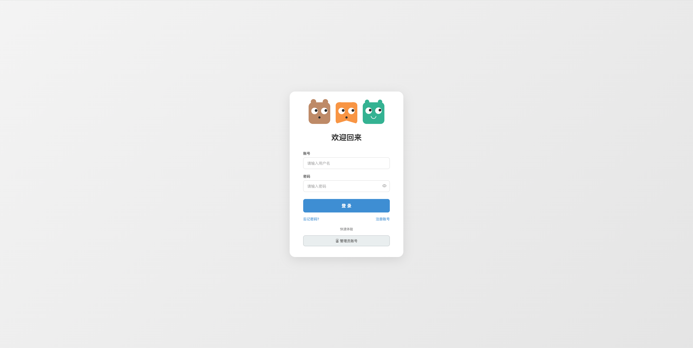
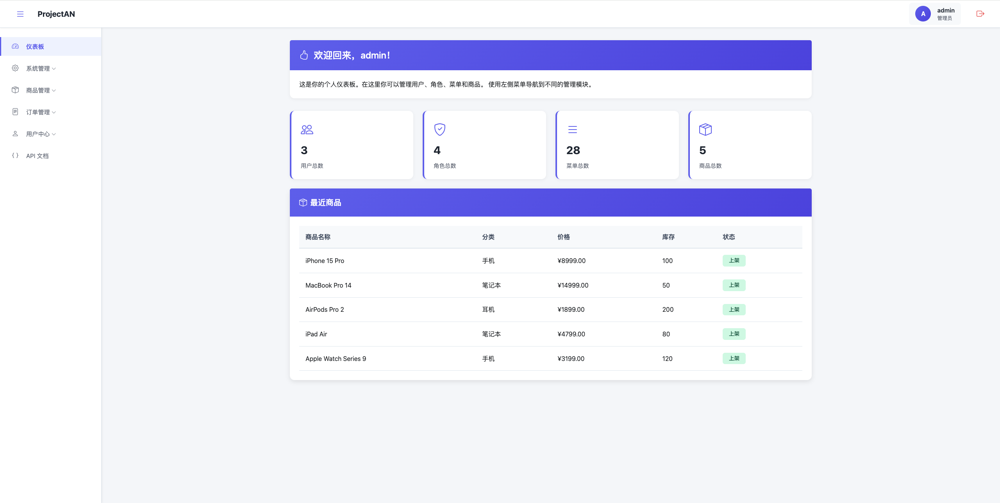
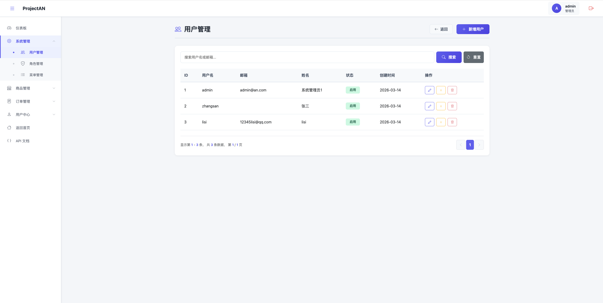

# ProjectAn01 - 企业级全栈应用

一个基于 Spring Boot 3.2 + Thymeleaf + MyBatis-Plus 的现代化企业级全栈应用，提供完整的用户管理、权限控制、菜单管理和产品管理功能。

## 🎯 项目特性

- **前后端不分离架构** - 使用 Thymeleaf 模板引擎，简化部署
- **完整的权限管理** - 基于 Spring Security 的角色权限控制
- **JWT 认证** - 安全的 Token 认证机制
- **现代化 UI** - 深色主题设计，响应式布局
- **RESTful API** - 完整的 API 文档（Swagger/OpenAPI）
- **数据库支持** - MySQL 和 H2（开发/测试）
- **Docker 支持** - 一键部署

## 📋 技术栈

| 技术 | 版本 |
|------|------|
| Java | 17 |
| Spring Boot | 3.2.0 |
| Spring Security | 6.x |
| MyBatis-Plus | 3.5.5 |
| Thymeleaf | 3.x |
| MySQL | 8.0+ |
| Lombok | Latest |
| JWT (JJWT) | 0.11.5 |

## 🚀 快速开始

### 前置要求

- Java 17+
- Maven 3.6+
- MySQL 8.0+（可选，开发时可用 H2）

### 安装步骤

1. **克隆项目**
```bash
git clone <repository-url>
cd projectAn01
```

2. **配置数据库**

编辑 `src/main/resources/application.yml`：

```yaml
spring:
  datasource:
    url: jdbc:mysql://localhost:3306/projectan01?useUnicode=true&characterEncoding=utf-8
    username: root
    password: your_password
    driver-class-name: com.mysql.cj.jdbc.Driver
```

3. **构建项目**
```bash
mvn clean install
```

4. **运行应用**
```bash
mvn spring-boot:run
```

应用将在 `http://localhost:8080` 启动

## 📸 功能演示

### 登录页面


### 首页


### 系统管理页


## 📁 项目结构

```
projectAn01/
├── src/main/java/com/an/
│   ├── config/              # 配置类
│   │   ├── SecurityConfig.java
│   │   ├── MyBatisPlusConfig.java
│   │   └── SwaggerConfig.java
│   ├── controller/          # 控制器
│   │   ├── AuthController.java
│   │   ├── UserController.java
│   │   ├── MenuController.java
│   │   ├── RoleController.java
│   │   └── ProductApiController.java
│   ├── service/             # 业务逻辑
│   │   ├── AuthService.java
│   │   ├── MenuService.java
│   │   └── ProductService.java
│   ├── entity/              # 数据实体
│   │   ├── User.java
│   │   ├── Role.java
│   │   ├── Menu.java
│   │   └── Product.java
│   ├── mapper/              # 数据访问层
│   ├── security/            # 安全相关
│   │   └── jwt/
│   ├── exception/           # 异常处理
│   └── util/                # 工具类
├── src/main/resources/
│   ├── templates/           # Thymeleaf 模板
│   │   ├── admin/
│   │   ├── auth/
│   │   ├── product/
│   │   └── error/
│   ├── static/              # 静态资源
│   │   ├── css/
│   │   ├── js/
│   │   └── images/
│   ├── mapper/              # MyBatis XML 映射
│   ├── sql/                 # SQL 脚本
│   └── application.yml      # 应用配置
├── pom.xml                  # Maven 配置
└── docker-compose.yml       # Docker 编排
```

## 🔐 核心功能

### 1. 用户认证与授权
- 用户注册和登录
- JWT Token 认证
- 基于角色的访问控制（RBAC）
- 密码加密存储

### 2. 用户管理
- 用户列表查询
- 用户创建、编辑、删除
- 用户角色分配
- 用户状态管理

### 3. 角色管理
- 角色创建和维护
- 角色权限分配
- 菜单权限绑定

### 4. 菜单管理
- 菜单树形结构
- 菜单权限控制
- 按钮级权限管理

### 5. 产品管理
- 产品列表展示
- 产品详情查看
- 产品分类管理
- 库存管理

## 🔌 API 文档

启动应用后，访问 Swagger UI：

```
http://localhost:8080/swagger-ui.html
```

主要 API 端点：

| 方法 | 端点 | 描述 |
|------|------|------|
| POST | `/api/auth/login` | 用户登录 |
| POST | `/api/auth/register` | 用户注册 |
| GET | `/api/admin/users` | 获取用户列表 |
| POST | `/api/admin/users` | 创建用户 |
| PUT | `/api/admin/users/{id}` | 更新用户 |
| DELETE | `/api/admin/users/{id}` | 删除用户 |
| GET | `/api/admin/menus` | 获取菜单列表 |
| GET | `/api/admin/roles` | 获取角色列表 |
| GET | `/api/products` | 获取产品列表 |

## 🐳 Docker 部署

### 使用 Docker Compose

```bash
docker-compose up -d
```

### 手动构建 Docker 镜像

```bash
docker build -t projectan01:latest .
docker run -p 8080:8080 projectan01:latest
```

## 📝 数据库初始化

项目启动时会自动执行 `src/main/resources/sql/init.sql` 初始化数据库：

- 创建必要的表结构
- 插入默认用户和角色
- 初始化菜单权限数据

## 🔧 配置说明

### application.yml 主要配置

```yaml
spring:
  application:
    name: projectAn01
  
  # 数据源配置
  datasource:
    url: jdbc:mysql://localhost:3306/projectan01
    username: root
    password: password
  
  # JPA 配置
  jpa:
    hibernate:
      ddl-auto: update
  
  # Thymeleaf 配置
  thymeleaf:
    cache: false
    prefix: classpath:/templates/
    suffix: .html

# JWT 配置
jwt:
  secret: your-secret-key
  expiration: 86400000  # 24 小时

# 日志配置
logging:
  level:
    root: INFO
    com.an: DEBUG
```

## 🧪 测试账户

系统初始化时创建的测试账户：

| 用户名 | 密码 | 角色 |
|--------|------|------|
| admin | admin123 | ADMIN |
| user | user123 | USER |

## 📚 开发指南

### 添加新的 API 端点

1. 创建 Controller 类
2. 定义 Service 接口和实现
3. 创建 Mapper 接口
4. 在 Swagger 中添加注解

### 添加新的菜单权限

1. 在数据库中插入菜单记录
2. 在 SecurityConfig 中配置权限
3. 在前端模板中使用权限标签

### 自定义主题

编辑 `src/main/resources/static/css/main.css` 中的 CSS 变量：

```css
:root {
  --accent: #f97316;
  --bg-deep: #0d0e12;
  --bg-card: #1a1d26;
  /* ... 更多变量 */
}
```

## 🐛 常见问题

### Q: 如何修改默认端口？
A: 在 `application.yml` 中添加：
```yaml
server:
  port: 9090
```

### Q: 如何启用 HTTPS？
A: 生成证书后在 `application.yml` 中配置：
```yaml
server:
  ssl:
    key-store: classpath:keystore.p12
    key-store-password: password
```

### Q: 如何自定义 JWT 过期时间？
A: 在 `application.yml` 中修改：
```yaml
jwt:
  expiration: 604800000  # 7 天
```

## 📄 许可证

MIT License

## 👥 贡献

欢迎提交 Issue 和 Pull Request！

## 📞 联系方式

如有问题或建议，请通过以下方式联系：

- 提交 Issue
- 发送邮件至 support@example.com

---

**最后更新**: 2026-03-16
